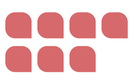

# Colours



## Overview

Colours is an application where a user can create projects and in detail save information of each color that was used.

## Project Status


## Project Screen Shot(s)

.. coming

## How to use?

### Access hosted application

This application is hosted on Netlify and you can access it on the following URL: [url]()

### Install locally

Clone the git repository

```javascript
git clone https://github.com/rebeckaalsterlind/save_colours.git
```

Go to the folder

```javascript
cd save_colours
```

Use the package manager [npm](https://www.npmjs.com/) to install the modules used in our color app.

```javascript
npm i
```

After the modules are downloaded and installed you can star the application locally.

```javascript
npm start
```

After the server started, navigate to the URL:

```javascript
localhost: 3000;
```

## API Reference

We use the following API: [ncsapi](https://github.com/MatsHaby/ncsapi) to convert the NCS-color value that the user enters to hex format.

## Backend

More information about the backend can you find here: [color-backend](https://github.com/MatsHaby/color-backend)
